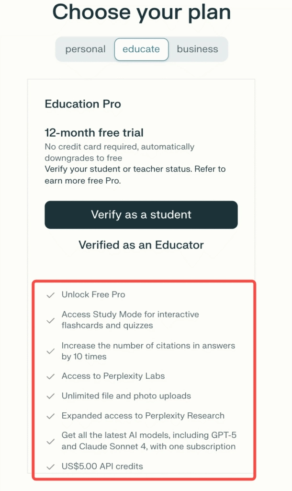
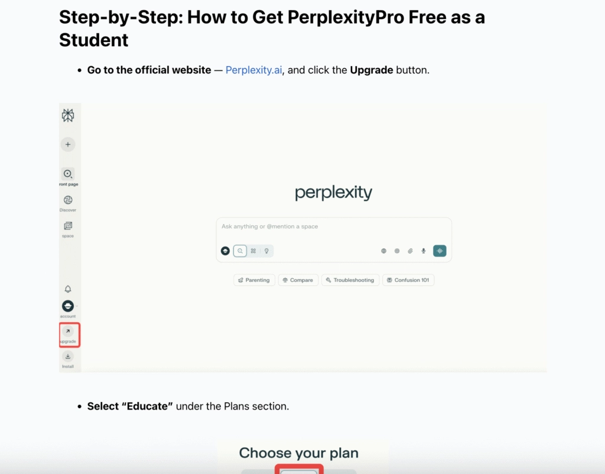
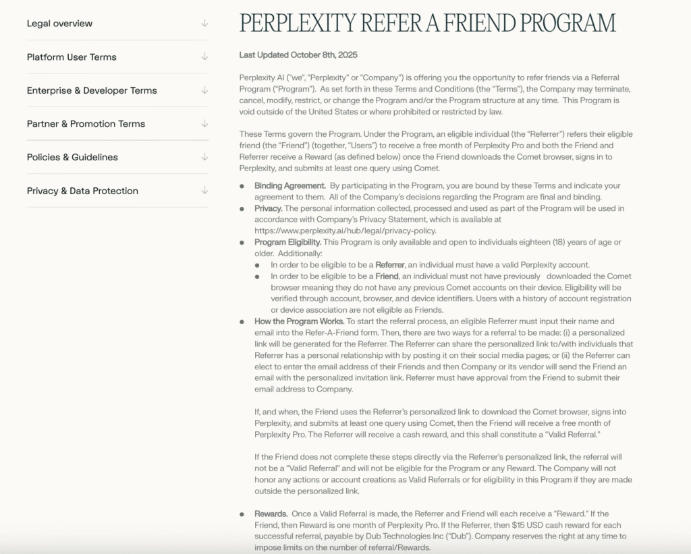

# Perplexity Free for Students: Get 12 Months of Pro Access Without Paying a Dime

---

Students and educators can unlock **Perplexity Pro completely free for a full year** through the official Education Plan. No credit card needed, no hidden fees—just verify your academic status and you're in. You get everything: Study Mode, unlimited file uploads, access to GPT-5 and Claude Sonnet 4, plus experimental features in Perplexity Labs. If you're juggling research papers, exam prep, or just trying to make sense of dense academic material, this is basically like having a research assistant who never sleeps and doesn't charge by the hour.

---

## What Exactly Is This Education Plan Thing?

So here's the deal. Perplexity normally charges around $20 a month for Pro. That's not terrible, but when you're a student surviving on instant noodles and questionable dining hall food, every dollar counts.

The **Education Plan** is Perplexity's way of saying "we get it" to students and teachers. You verify you're actually in school, and boom—12 months of Pro access. For free. No credit card at signup, and when the year's up, it just rolls back to the free tier. You don't wake up to surprise charges.

Here's what you actually get:

- Full **Perplexity Pro features** (the real deal, not some watered-down version)
- **12-month free access** that doesn't auto-charge you later
- **Study Mode** for making flashcards and quizzes without the manual labor
- **Research Mode** with way more citations than the free version
- **Unlimited file uploads**—throw your PDFs, images, whatever at it
- Access to **Perplexity Labs** to test experimental AI tools
- **$5 in API credits** if you're the coding type
- Multi-model AI access including **GPT-5** and **Claude Sonnet 4**

It's basically the full buffet, not just the salad bar.

## Who Actually Qualifies?

You don't need to be at Harvard or MIT. The eligibility is pretty straightforward:

- **College or university students** with an academic email (those .edu or .ac addresses)
- **High school students** (you'll need some proof like a student ID)
- **Teachers, professors, lecturers**—basically anyone teaching
- **Academic researchers** tied to educational institutions

One thing to note: if your school email doesn't automatically work, don't panic. You can manually submit verification through Perplexity's support. Just have a photo of your student ID or enrollment letter ready.

## How to Actually Get It (The Real Steps)

Alright, let's walk through this. It's not complicated, but there are a few spots where people get stuck.

**Step 1: Head to the Education Plan page**

Go to Perplexity's official education signup. You can find it through their main site or 👉 [unlock your free Pro access here and skip the search](https://pplx.ai/ixkwood69619635).

**Step 2: Sign up with your school email**

Use your .edu or .ac email. If you're using Gmail or Yahoo, it won't work. The system checks the domain automatically.

**Step 3: Verify your status**

Most academic emails get verified instantly. If yours doesn't, you'll get a prompt to upload proof—student ID, enrollment letter, whatever shows you're legit.

**Step 4: Wait for confirmation**

Usually takes 24-48 hours if manual review is needed. Check your email (including spam folder, because of course).

**Step 5: Start using Pro**

Once approved, your account automatically upgrades to **Perplexity Pro (Education)**. No extra steps, no payment info needed.

## What You Can Actually Do With It

Let's talk about the features that actually matter when you're drowning in coursework.

**Study Mode** is probably the most useful if you're prepping for exams. You feed it your notes or a textbook chapter, and it generates flashcards, summaries, and practice quizzes. It's like having a study buddy who actually read the material.

**Research Mode** is where things get serious. When you're writing a paper and need real citations, this mode digs deeper and gives you up to 10× more sources than the free version. It's not just pulling random internet stuff—it's finding academic sources, papers, credible references.

**Unlimited uploads** means you can throw entire PDFs at it. Lecture slides, research papers, your own notes—whatever. Then you can ask questions about the content without having to skim through 50 pages yourself.

**Perplexity Labs** gives you early access to experimental features. Some work great, some are weird, but it's fun to mess around with cutting-edge AI tools before they're officially released.

And here's the kicker: you get access to **multiple AI models** in one place. GPT-5, Claude Sonnet 4, and others. You're not locked into one AI's way of thinking. If one model gives you a weird answer, try another.

## When Things Don't Work (Troubleshooting)

Sometimes the verification process hiccups. Here's what usually fixes it:

**Your email isn't recognized:** Not all schools use standard .edu domains. If yours doesn't work, go the manual route and submit your student ID directly to support.

**Verification is taking forever:** Check your spam folder first. If it's been more than 48 hours, reach out to Perplexity support with your proof of enrollment attached.

**You're on mobile and it's acting weird:** Try signing up from a desktop browser instead. The mobile experience can be glitchy during verification.

**You graduated but still have your email:** Technically you're not eligible anymore, but if your email still works and you're in grad school or continuing education, you might still qualify. Worth a shot.

## Making It Last Beyond 12 Months

So you've got a year of free Pro. What happens after?

The account automatically downgrades to the free tier. You don't lose your data or history, you just lose the Pro features. But there are ways to keep the good stuff going:

**Refer friends:** Perplexity has a referral program. Get classmates to sign up, earn rewards, potentially extend your access.

**Reapply next year:** If you're still enrolled, you can verify again and get another 12 months. As long as you're a student, you can keep renewing.

**Switch to an all-in-one plan:** If you're using multiple AI tools anyway (ChatGPT, Gemini, etc.), something like Global GPT bundles them together for less than paying for each separately. 👉 [See how much you'd actually save with combined AI access](https://pplx.ai/ixkwood69619635).

## Why This Actually Matters

Look, AI tools are becoming as basic as Google for research and learning. But most of them cost money, and students are usually broke. Perplexity's Education Plan removes that barrier.

You're not getting a discount or a trial that sneakily charges you later. You're getting the full Pro experience for free, for a year, with no strings attached. For research, studying, writing papers, or just understanding complex topics faster, it's one of the better deals out there.

And if you're already using other AI tools, it's worth checking if bundling them makes more sense than paying for each one separately. But either way, starting with 12 months of free Perplexity Pro? That's a no-brainer.

---

## Wrapping It Up

Getting **Perplexity Pro free as a student** is straightforward: verify your academic status, get 12 months of full access, and use it however you need. No payment info, no surprise charges, just a solid AI research tool that actually helps with schoolwork. If you're still deciding whether it's worth the signup process, remember that Perplexity is built for exactly this—digging through information and giving you clear, cited answers. And for students juggling deadlines and dense reading lists, that's pretty much gold.
